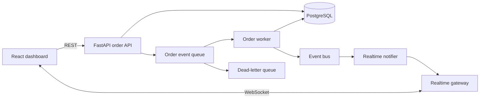

# OrderFlow Architecture and Contracts

## Runtime model

The API, worker, and web application run locally first. Cloud deployments replace the runtime boundary without changing the domain or event contracts.

## REST API

- `POST /api/orders` creates a synthetic order and returns `202 Accepted`.
- `GET /api/orders` lists at most 100 orders and accepts optional `status` filtering.
- `GET /api/orders/{order_id}` returns the order and its event timeline.
- `POST /api/orders/{order_id}/events` requests the next allowed state transition.
- `GET /health/live` proves process liveness.
- `GET /health/ready` proves required dependency readiness without exposing configuration.
- `GET /orders` is the local WebSocket endpoint. AWS uses API Gateway WebSocket with the same message contract.

## State machine

The normal path is `CREATED -> VALIDATED -> PACKED -> SHIPPED -> DELIVERED`.
`FAILED` is terminal and may be entered from any non-terminal state by an explicit failure event.
All other transitions are rejected.

## Event envelope

The normative JSON Schema is `contracts/order-event.schema.json`.

- `event_id` is globally unique and is the idempotency key.
- `(order_id, sequence)` is unique and prevents competing state versions.
- Timestamps are UTC ISO-8601 values.
- Consumers assume at-least-once delivery and must make duplicates a no-op.
- Environment is explicit and cross-environment messages fail closed.
- Logs include `correlation_id`, not unrestricted message bodies.

## Data authority

- PostgreSQL `orders` is authoritative for current order state.
- PostgreSQL `order_events` is authoritative for the accepted event history.
- Queue visibility and logs are supporting operational evidence, not business state.
- The UI reports unavailable or stale data explicitly and never converts it to healthy or zero.
