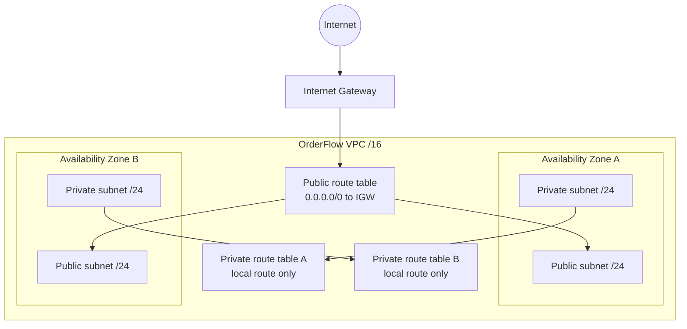

# Week 5: VPC and networking

Status: **Prepared** on 13 September 2026. The Terraform topology and fail-closed
input guards are locally defined; no VPC resources have been created.

## Topology contract

The module deliberately creates no NAT Gateway. A subnet is public because its route table has a
route to an Internet Gateway; merely naming it `public` does not make it public. Instances also need
a public IPv4 address or equivalent edge path, security-group permission, and a listening service.

## Packet-path reasoning

Browser to public workload:

1. DNS resolves the public endpoint.
2. Traffic enters through the Internet Gateway.
3. The public route table maps the return path to the Internet Gateway.
4. The workload security group permits only the intended listener and source.
5. The network ACL is stateless and must permit both request and ephemeral return traffic.

Application to private PostgreSQL:

1. The application resolves the private database endpoint inside the VPC.
2. VPC local routing carries the packet between subnets.
3. The database security group permits TCP 5432 from the application security group, not from a CIDR open to the Internet.
4. The database has no public endpoint or Internet Gateway route.

Security groups are stateful and attach to network interfaces. Network ACLs are stateless subnet
guardrails. For routine OrderFlow labs, security groups carry the primary least-privilege rules and
the default network ACL remains unchanged unless the lesson explicitly tests it.

## Fail-closed Terraform checks

Deployment requires:

- exactly two reviewed Availability Zones;
- exactly two public and two private subnet CIDRs;
- every subnet contained by the VPC CIDR;
- four unique, non-overlapping subnet CIDRs;
- exact account and Region matches plus owner and expiry metadata.

The public subnets set `map_public_ip_on_launch = false`; public IPv4 assignment must be an explicit,
cost-reviewed choice for a specific workload.

## Guided manual lab

### Reviewed lab inputs

Use these generic values only after the console header confirms the personal-learning account and
`us-east-1`. The two Availability Zones must be selected from the currently available zones shown
by the account; record their names in private session notes rather than assuming them in Git.

| Resource | Name | CIDR or route |
| --- | --- | --- |
| VPC | `orderflow-dev-vpc` | `10.42.0.0/16` |
| Public subnet A | `orderflow-dev-public-1` | `10.42.0.0/24` |
| Public subnet B | `orderflow-dev-public-2` | `10.42.1.0/24` |
| Private subnet A | `orderflow-dev-private-1` | `10.42.10.0/24` |
| Private subnet B | `orderflow-dev-private-2` | `10.42.11.0/24` |
| Public route table | `orderflow-dev-public` | `0.0.0.0/0` to the lab Internet Gateway |
| Private route tables | `orderflow-dev-private-1`, `orderflow-dev-private-2` | local route only |

Apply all required project tags to taggable resources. Set `ExpiresOn` to the same lab-day date used
for teardown; never put an account ID, email address, or enterprise identifier in a tag.

### Cost boundary

The intended lab creates only a VPC, four subnets, route tables, route-table associations, and one
Internet Gateway. AWS does not charge hourly for those objects themselves, but traffic and resources
attached later can be billable. Do not create a NAT Gateway, VPC endpoint, Elastic IP, public IPv4
address, flow-log destination, EC2 instance, load balancer, or Network Firewall during this lab.
The signed-in Billing pages remain authoritative for actual account charges and credits.

### Execution and evidence

1. Run the account/role/Region preflight and review the zero-NAT boundary above.
2. Create the two-AZ topology manually in the VPC console using the reviewed, non-overlapping CIDRs.
3. Verify route-table associations and DNS settings in the rendered console.
4. Compare security-group statefulness with network-ACL statelessness using diagrams and flow-log reasoning.
5. Do not launch an instance merely to prove the VPC exists; that belongs to the EC2 lab.
6. Record sanitized counts and relationships only; exclude account IDs, ARNs, owner identity, and screenshots containing console-header identifiers.

### Same-session teardown

Delete in reverse dependency order before leaving the session:

1. Confirm there are no instances, load balancers, NAT Gateways, endpoints, or unexpected network interfaces in the lab VPC.
2. Delete the custom subnet-to-route-table associations, then the custom route tables.
3. Delete all four lab subnets.
4. Detach and delete the lab Internet Gateway.
5. Delete the lab VPC.
6. Search the VPC console by the `Project=OrderFlow` and `Environment=dev` tags and verify zero matching lab VPCs, subnets, route tables, Internet Gateways, NAT Gateways, endpoints, and Elastic IPs remain.

If any dependency prevents deletion, stop and inspect that exact dependency. Do not delete an
untagged or unrelated resource to make teardown succeed.

## Evidence status

- **Confirmed:** source topology contains one VPC, two public subnets, two private subnets, one Internet Gateway, public routing, isolated private route tables, and no NAT Gateway.
- **Partial:** Terraform validation was previously confirmed for the inert root; re-run it after this guard change when WSL access is available.
- **Unverified:** personal-account manual creation, console packet-path inspection, and teardown.
