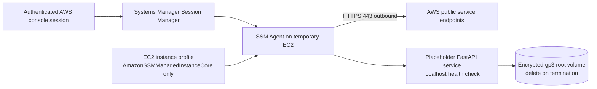

# Week 6: EC2, EBS, Systems Manager, ELB, and Auto Scaling fundamentals

Status: **Prepared** on 13 September 2026. This record defines the bounded personal-learning lab;
no EC2, EBS, public IPv4, load-balancing, or Auto Scaling resource has been created.

## Learning objective

Launch one temporary Linux instance, connect through AWS Systems Manager Session Manager without
SSH, inspect its instance metadata and boot evidence, run the placeholder OrderFlow API, and then
terminate and inventory every charge-bearing dependency. Elastic Load Balancing and Auto Scaling
are architecture and console-inspection topics in this lab; they are not deployed until the later
ECS operations lab.

## Architecture and trust boundary

Session Manager is the administration path. The instance has no inbound security-group rules, no
SSH key pair, and no persistent AWS access key. The instance profile grants only the managed-instance
permissions required by SSM; it does not grant OrderFlow application or data access.

## Preflight contract

Before launch, verify the visible account and `us-east-1`, then review each value in the final
summary page:

| Setting | Required value or boundary |
| --- | --- |
| Environment | Personal-learning account only |
| AMI | Current AWS-provided Linux image with SSM Agent support |
| Instance type | Smallest type currently shown as plan/credit eligible for this account |
| Count | Exactly one |
| Network | Reviewed Week 5 lab VPC and one public subnet |
| Public IPv4 | Explicitly enabled only for this short SSM-over-Internet lab |
| Security group | No inbound rules; outbound DNS and HTTPS only |
| Key pair | None |
| Metadata | IMDSv2 required; hop limit `1`; metadata tags disabled |
| Root volume | Minimum practical encrypted `gp3`; delete on termination |
| Monitoring | Basic monitoring; no detailed-monitoring charge |
| Instance profile | Dedicated lab profile with `AmazonSSMManagedInstanceCore` only |
| Termination protection | Disabled so same-session teardown can complete |
| Tags | `Project`, `Environment`, `Owner`, `ManagedBy`, and same-day `ExpiresOn` |

Do not assume an instance type is free. The signed-in creation summary, Free Plan eligibility, and
Billing pages are authoritative. Record the displayed estimate privately before launch. The session
target is less than two hours and less than USD 1 of estimated usage, including the instance, EBS,
public IPv4, and logs. Stop if the estimate or eligibility cannot be verified.

## Guided execution

1. Run the redacted account/role/Region preflight and the read-only cleanup inventory.
2. Create the dedicated SSM role and instance profile; verify the EC2 trust principal and attached
   `AmazonSSMManagedInstanceCore` policy before use.
3. Launch exactly one instance with the reviewed settings above. Do not open port 22 or create a key pair.
4. Wait for both EC2 status checks and the Systems Manager managed-node connection to become healthy.
5. Start Session Manager and run only non-secret checks: OS release, current user, disk layout,
   service status, and an IMDSv2-token-protected metadata query for instance identity fields.
6. Deploy the placeholder API from the public synthetic repository or a checksum-recorded local
   package, start it under a temporary systemd unit, and verify `/health/live` locally.
7. Inspect user-data output, cloud-init logs, the root EBS settings, and EC2 system log. Sanitize all
   identifiers before writing evidence.
8. Stop the API and test a deliberate health-check failure, then restart only the API service and
   confirm recovery. Do not reboot the host merely to recover an application process.
9. Review—without creating—how an ALB target-group health check and an Auto Scaling Group would
   replace an unhealthy instance.

## Success and negative evidence

- **Connection:** Session Manager opens without port 22, a key pair, or a public SSH listener.
- **Identity:** the workload obtains SSM permissions through the instance profile; no credential value is displayed.
- **Metadata:** an IMDSv1 request fails while an IMDSv2-token request succeeds.
- **Storage:** the root volume is encrypted and marked for deletion on termination.
- **Application:** `/health/live` succeeds, fails during the controlled service stop, and succeeds after restart.
- **Observability:** EC2 status checks, SSM connection status, systemd state, and boot logs are traceable.

## Same-session teardown

1. Stop the placeholder service and preserve only sanitized learning notes.
2. Terminate the exact tagged lab instance and wait until its state is `terminated`.
3. Verify its root EBS volume was deleted; check for unattached volumes and snapshots independently.
4. Verify no Elastic IP, public IPv4 allocation, ENI, load balancer, target group, launch template,
   Auto Scaling Group, or unexpected CloudWatch log group remains from the lab.
5. Remove the dedicated instance profile and role only after confirming no instance uses them.
6. Re-run the read-only cleanup inventory and record unavailable checks explicitly rather than as zero.

Termination is intentional and not reversible. Perform it only against the exact instance whose
tags, instance ID, launch time, and lab purpose were revalidated immediately before the action.

## Evidence status

- **Confirmed:** this repository defines the no-SSH, IMDSv2, encrypted-EBS, instance-profile, cost,
  negative-test, and teardown requirements.
- **Unverified:** current Free Plan instance eligibility, displayed estimate, instance launch,
  SSM connection, application health, failure recovery, termination, and post-teardown inventory.

