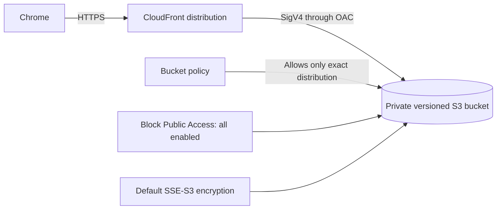

# Week 7: S3, CloudFront, encryption, lifecycle, and backup concepts

Status: **Prepared** on 13 September 2026. The lab contract is defined locally; no bucket,
distribution, origin access control, key, log destination, or DNS record has been created.

## Learning objective

Publish a small synthetic React build through CloudFront while the S3 origin remains private.
Prove version recovery, default encryption, cache invalidation behavior, and lifecycle configuration,
then remove the distribution and every version of every temporary object.

## Architecture and access path

Use the S3 REST origin with CloudFront Origin Access Control (OAC), not the S3 website endpoint.
The bucket policy permits `s3:GetObject` only to the CloudFront service principal when the request
comes from the exact distribution. Direct anonymous S3 access must remain denied.

## Responsibility boundary

The learner manually performs every AWS create, update, disable, and delete action. Codex may explain
settings, inspect rendered console state read-only, and verify evidence, but must not perform AWS
resource mutations. Passwords, MFA, CAPTCHA, credentials, and trusted-device actions remain user-only.

## Preflight and cost boundary

Before creation, verify the personal-learning account and `us-east-1`. CloudFront is global, but the
origin bucket for this lab is in `us-east-1`. Record the signed-in Free Plan/credit eligibility and
the current estimate privately; do not infer zero cost from a small workload.

The lab permits only:

- one uniquely named private S3 bucket;
- one CloudFront distribution using the default CloudFront hostname;
- one OAC and the exact bucket-policy statement it requires;
- a small React build containing only public synthetic assets;
- one short lifecycle rule for noncurrent-version cleanup, observed as configuration rather than
  waiting days for execution; and
- one deliberate CloudFront invalidation after a verified stale-cache observation.

Do not create Route 53 records, ACM certificates, custom domains, customer-managed KMS keys,
replication buckets, access-log buckets, Lambda@Edge functions, CloudFront Functions, or S3 website
hosting in this lab. Keep the distribution only for the active session; CloudFront disablement and
deletion can take time, so begin teardown well before the session ends.

## Required settings

| Control | Required state |
| --- | --- |
| Object Ownership | Bucket owner enforced; ACLs disabled |
| Block Public Access | All four settings enabled |
| Versioning | Enabled before the first application upload |
| Default encryption | SSE-S3 for this bounded lab |
| Bucket policy | Exact CloudFront distribution condition; no public principal |
| CloudFront viewer protocol | Redirect HTTP to HTTPS |
| Origin protocol | HTTPS only through the S3 REST origin |
| Default root object | `index.html` |
| Price class | Lowest reviewed class adequate for the lab |
| WAF | Not enabled for this short synthetic lab |
| Tags | `Project`, `Environment`, `Owner`, `ManagedBy`, and same-day `ExpiresOn` where supported |

SSE-S3 demonstrates encryption at rest without creating a billable customer-managed key. Compare
SSE-S3, SSE-KMS, DSSE-KMS, and client-side encryption conceptually, including key-policy and request-
cost tradeoffs, but do not create a KMS key merely for the comparison.

## Learner-led execution

1. Run the account/Region preflight and a read-only resource inventory.
2. Build the React frontend locally and inspect the output for source maps, secrets, account IDs,
   internal URLs, and non-synthetic data before upload.
3. Manually create the bucket with versioning, Block Public Access, ACLs disabled, default SSE-S3,
   required tags, and no public website configuration.
4. Upload only the inspected build files. Record file count and an aggregate local manifest hash,
   not bucket identifiers or signed URLs, in public evidence.
5. Manually create an OAC and CloudFront distribution. Apply only the generated,
   distribution-scoped read statement to the bucket policy.
6. Verify the CloudFront hostname serves the React entry page over HTTPS, while direct anonymous S3
   object and bucket requests fail closed.
7. Replace one synthetic asset, verify that S3 has both versions, restore the earlier version, and
   verify the restored content through a cache-bypassing check.
8. Update the asset again without invalidation and observe whether the cached representation remains.
   Manually create one bounded invalidation, then verify the new representation and its completion.
9. Add a lifecycle rule for aborting incomplete multipart uploads and expiring noncurrent versions
   after a reviewed interval. Verify the rule configuration; do not claim lifecycle execution occurred.
10. Explain why S3 versioning helps recover accidental overwrites but is not, by itself, an isolated
    backup against every deletion, policy error, compromised identity, or account-level event.

## Negative tests

- Anonymous S3 object retrieval is denied.
- Bucket listing is denied to the CloudFront distribution because only object reads are needed.
- HTTP viewer requests redirect to HTTPS.
- Uploading a file outside the inspected build allowlist is rejected by the local process.
- A prior object version can be restored without making the bucket public.
- Cache behavior before and after the single invalidation is observable and explainable.

## Learner-performed same-session teardown

1. Disable the exact tagged CloudFront distribution and wait until its deployed state confirms the change.
2. Delete the disabled distribution, then delete the OAC after confirming no distribution uses it.
3. Remove every object version, delete marker, and incomplete multipart upload from the exact lab bucket.
4. Delete the empty bucket.
5. Independently verify that no lab distribution, OAC, bucket, object version, invalidation in progress,
   custom key, DNS record, certificate, or logging destination remains.
6. Record permission-denied or unavailable inventory surfaces explicitly; never translate them to zero.

Deleting object versions and the bucket is irreversible. The learner must revalidate the bucket name,
project tags, creation time, object inventory, and lab purpose immediately before deletion. Never run
a broad recursive deletion against an unresolved name, wildcard, account-wide result, or unrelated bucket.

## Evidence status

- **Confirmed:** the repository documents private-origin access, OAC scoping, encryption, version
  recovery, cache testing, lifecycle limits, cost boundaries, manual ownership, and teardown.
- **Unverified:** signed-in eligibility and estimate, build upload, rendered CloudFront page, direct-S3
  denial, version restore, invalidation completion, lifecycle configuration, and final resource inventory.

